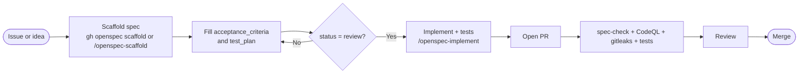

# Contributing to {{PROJECT_NAME}}

Thanks for taking the time to contribute! This project is built on
**[OpenSpec](.openspec/)** — a spec-driven development workflow that keeps
every change small, tested, and documented. Please read this guide before
opening your first pull request.

---

## Ground Rules

1. **Every change starts with a spec.** No code lands without a matching spec
   file under `.openspec/specs/`. CI enforces this on every PR.
2. **Tests ship with the code.** Every acceptance criterion should be backed
   by an entry in the spec's `test_plan`, and every test plan item should be a
   real test in the same PR.
3. **Surgical changes only.** Touch only what the spec requires. Unrelated
   refactors go in separate PRs with their own specs.
4. **Be excellent to each other.** This project follows the
   [Contributor Covenant Code of Conduct](CODE_OF_CONDUCT.md).

---

## Workflow



### 1. Fork and clone

```bash
git clone https://github.com/{{GITHUB_OWNER}}/{{PROJECT_NAME}}.git
cd {{PROJECT_NAME}}
bash setup.sh  # installs the OpenSpec git hooks locally
```

### 2. Create (or find) the spec

Check if a spec already exists:

```bash
ls .openspec/specs/
```

If none matches what you want to build, scaffold one:

```bash
gh openspec scaffold "my feature"
# or in Claude Code:
/openspec-scaffold my feature
```

Fill in:
- `description` — what and why
- `acceptance_criteria` — at least one verifiable item
- `test_plan` — at least one test per AC
- `out_of_scope` — what this explicitly does NOT cover

Set `status: review` when ready. Code written against a `draft` spec will be
rejected by CI.

### 3. Implement

```bash
/openspec-implement my-feature   # Claude Code
```

Claude reads the spec, invokes the domain skill (if `implementation_skill` is
set), writes the code, and writes the tests in the same pass.

### 4. Validate locally

```bash
gh openspec check            # spec coverage for current changes
gh openspec check --strict   # treat warnings as errors
# run your test command (configured in .openspec/config.yaml)
```

Optional but recommended — install the pre-commit framework:

```bash
pip install pre-commit
pre-commit install
```

This runs trailing-whitespace cleanup, YAML/merge-conflict checks, private-key
detection, and [gitleaks](https://github.com/gitleaks/gitleaks) on every
commit.

### 5. Commit

Commit messages follow a loose convention — keep them imperative and
descriptive. If the project has `hooks.commit_msg.require_spec_reference`
enabled, include the spec slug:

```
feat: add dark mode toggle

spec: dark-mode-toggle
```

### 6. Push and open a PR

Use the provided [pull request template](.github/pull_request_template.md).
The template asks you to:

- Link the OpenSpec spec file
- List the acceptance criteria you satisfied
- Confirm tests were added
- Note any README / CHANGELOG updates

---

## CI Checks

Your PR must pass:

| Check | What it does |
|---|---|
| **OpenSpec PR Check** | Validates spec coverage and required fields |
| **OpenSpec AI Review** | Semantic alignment between spec and implementation |
| **Tests** | Runs `testing.test_command` from `.openspec/config.yaml` |
| **CodeQL** | Static analysis for security issues |
| **Gitleaks** | Secret scanning |
| **Dependency Review** | Blocks known-vulnerable or disallowed-license deps |

All checks are required. A maintainer will request changes if anything fails.

---

## Style

- Follow the [Karpathy coding guidelines](CLAUDE.md#coding-guidelines-karpathy)
  embedded in `CLAUDE.md` — simplicity first, surgical changes, no speculative
  abstractions.
- `.editorconfig` and `.gitattributes` handle formatting. Don't fight them.
- Diagrams are [Mermaid](https://mermaid.js.org/) inside fenced code blocks —
  no image files unless absolutely necessary.

---

## Reporting Bugs

Use the [Bug report](.github/ISSUE_TEMPLATE/bug_report.yml) issue form.
Security bugs go through [SECURITY.md](SECURITY.md) instead.

## Requesting Features

Use the [Feature request](.github/ISSUE_TEMPLATE/feature_request.yml) form.
The maintainer will ask you to convert it into a spec before implementation
begins.

## Questions

For general OpenSpec questions, use the
[Spec question](.github/ISSUE_TEMPLATE/spec_question.yml) form or
[SUPPORT.md](SUPPORT.md).

---

Thanks again — looking forward to your contribution!
