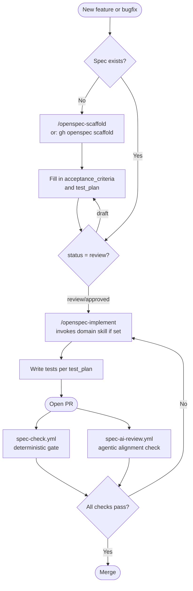
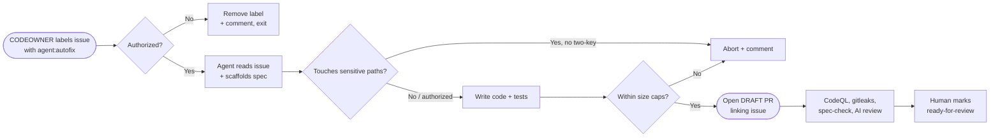

# {{PROJECT_NAME}}

{{BADGES}}

{{PROJECT_DESCRIPTION}}

---

## What is OpenSpec?

OpenSpec is a spec-driven development framework built into this repo. Every feature or bugfix starts with a spec file — no spec, no code. Specs define acceptance criteria, test plans, and the domain skill to use during implementation.

**Layers of enforcement:**

| Layer | When | What |
|---|---|---|
| Git hook (local) | `git commit` | Blocks commits with source changes but no spec |
| Pre-commit framework (optional) | `git commit` | Runs gitleaks, yamllint, markdownlint, shellcheck |
| CI — deterministic | Every PR | Validates spec fields, status, test_plan, and runs the test suite |
| CI — agentic | Every PR | AI checks if the implementation actually satisfies the spec |
| CI — security | Every PR | CodeQL SAST, gitleaks secret scan, dependency review |
| CI — supply chain | Every release | CycloneDX SBOM generation |

---

## How it works



---

## Quick start

### 1. Configure this repo

Open it in [Claude Code](https://claude.ai/code) — it detects the unconfigured state and interviews you automatically.

Or configure manually:

```bash
# Edit the five required fields
vi .openspec/config.yaml

# Install git hooks
bash setup.sh
```

### 2. Set your personal defaults (optional)

Fill in `.openspec/defaults.yaml` once — onboarding will skip questions you've already answered:

```yaml
owner: "your-github-org"
team: "your-team"
test_command: "npm test"
default_implementation_skill: "frontend-pro"  # or backend-pro, devops-pro, etc.
```

### 3. Create your first spec

```bash
gh openspec scaffold "my first feature"
# or in Claude Code:
/openspec-scaffold my first feature
```

### 4. Implement with the right domain skill

```bash
# In Claude Code — reads the spec, invokes implementation_skill if set
/openspec-implement my-first-feature
```

### 5. Validate before pushing

```bash
gh openspec check           # validate all specs
gh openspec check --strict  # treat warnings as errors
gh openspec check --pr 42   # check a specific PR
```

---

## Claude Code skills

Three project skills are available in any Claude Code session:

| Skill | What it does |
|---|---|
| `/openspec-scaffold [feature]` | Guided spec creation — reads defaults, scaffolds file, validates required fields |
| `/openspec-implement [slug]` | Reads spec, checks status, invokes domain skill, implements + writes tests |
| `/openspec-check` | Validates spec coverage for current staged changes |

---

## Project structure

```
.openspec/
├── config.yaml              # Project configuration and enforcement settings
├── defaults.yaml            # Personal/team defaults (fill in once)
├── onboarding.yaml          # Questions Claude Code asks during first-time setup
├── specs/                   # Active spec files (one per feature/bugfix)
│   └── example-feature.spec.yaml
└── templates/
    ├── feature.spec.yaml    # Includes optional eval_plan for AI-backed features
    └── bugfix.spec.yaml

.harness/                    # Eval harness — proves specs under controlled conditions
├── scenarios/               # Declarative eval scenarios (agent tasks, prompt runs)
│   └── example.scenario.yaml
├── evaluators/              # Rubrics and scripts that score scenario runs
├── mocks/                   # Mock tools, APIs, and data sources
└── traces/                  # Captured execution traces (gitignored by default)

.github/
├── workflows/
│   ├── spec-check.yml           # Deterministic CI gate + test runner
│   ├── spec-ai-review.yml       # Agentic semantic review
│   ├── spec-bootstrap.yml       # First-push setup reminder
│   ├── issue-autofix.yml        # CODEOWNER-gated issue auto-fix agent
│   ├── lint.yml                 # actionlint, yamllint, shellcheck, markdownlint
│   ├── release.yml              # Tag → SBOM + cosign sign + SLSA provenance
│   ├── scorecard.yml            # OSSF Scorecard supply-chain analysis
│   ├── dependabot-automerge.yml # Auto-merge Dependabot patch updates
│   ├── template-smoke-test.yml  # Weekly E2E test of the template itself
│   ├── dco.yml                  # Developer Certificate of Origin check
│   ├── repo-init.yml            # Creates `main` branch on new repos from template
│   ├── codeql.yml               # Static analysis (SAST)
│   ├── secret-scan.yml          # Gitleaks secret scanning
│   ├── dependency-review.yml    # Vulnerable / disallowed-license deps
│   ├── sbom.yml                 # CycloneDX SBOM on release
│   ├── labeler.yml              # Path-based PR labels
│   ├── release-drafter.yml      # Auto-drafted release notes
│   └── stale.yml                # Stale issue/PR bot
├── ISSUE_TEMPLATE/
│   ├── bug_report.yml
│   ├── feature_request.yml
│   ├── spec_question.yml
│   └── config.yml
├── agents/
│   ├── spec-review.md           # AI agent goal file
│   └── issue-autofix.md         # Auto-fix agent goal file
├── labels.yml                   # Source-of-truth label manifest
├── CODEOWNERS                   # Ownership matrix
├── FUNDING.yml                  # Sponsor links
├── AGENTS.md                    # Instructions for AI agents
├── copilot-instructions.md      # GitHub Copilot instructions
├── dependabot.yml               # Weekly dependency updates
├── labeler.yml                  # Rules for path-based labelling
├── pull_request_template.md     # Structured PR template
└── release-drafter.yml          # Release-notes grouping config

.claude/
├── commands/
│   ├── openspec-scaffold.md
│   ├── openspec-implement.md
│   └── openspec-check.md
├── hooks/
│   └── require-spec-on-commit.sh
└── settings.json

docs/
├── adr/                         # Architecture Decision Records
│   └── 0001-record-architecture-decisions.md
└── BRANCH_PROTECTION.md         # Recommended ruleset configuration

Governance (repo root):
├── SECURITY.md                  # Vulnerability disclosure policy
├── CONTRIBUTING.md              # Contribution guide (spec-first)
├── CODE_OF_CONDUCT.md           # Contributor Covenant v2.1
├── SUPPORT.md                   # Support channels
├── CHANGELOG.md                 # Keep-a-Changelog
├── .gitignore                   # Multi-language defaults
├── .gitattributes               # Line endings + linguist hints
├── .editorconfig                # Editor formatting rules
├── .pre-commit-config.yaml      # Optional pre-commit hooks
└── .yamllint                    # YAML lint rules
```

## Governance

| File | Purpose |
|---|---|
| [SECURITY.md](SECURITY.md) | Report a vulnerability privately |
| [CONTRIBUTING.md](CONTRIBUTING.md) | How to contribute — spec-first |
| [CODE_OF_CONDUCT.md](CODE_OF_CONDUCT.md) | Contributor Covenant v2.1 |
| [SUPPORT.md](SUPPORT.md) | Where to get help |
| [CHANGELOG.md](CHANGELOG.md) | Release history |
| [.github/CODEOWNERS](.github/CODEOWNERS) | Ownership matrix |
| [docs/BRANCH_PROTECTION.md](docs/BRANCH_PROTECTION.md) | Recommended GitHub rulesets |

---

## Spec file format

See `.openspec/specs/example-feature.spec.yaml` for a fully filled-in reference.

Required fields: `title`, `description`, `acceptance_criteria`, `test_plan`, `status`

Status lifecycle: `draft` → `review` → `approved`

> Code can only be written when status is `review` or `approved`.

---

## OpenSpec vs Harness

OpenSpec defines **what should be true.**
Tests and harnesses prove **whether it is true.**

For normal software, this means unit, integration, and end-to-end tests — captured in each spec's `test_plan`.

For AI systems, verification often requires more:

| Concern | Tool |
|---|---|
| Functional correctness | Unit / integration tests (`test_plan`) |
| Agent task success | Eval scenarios (`.harness/scenarios/`) |
| Grounding and citation accuracy | Evaluators (`.harness/evaluators/`) |
| Tool use correctness | Mocked tool runs (`.harness/mocks/`) |
| Latency and cost budgets | Scenario `thresholds` + `metrics` |
| Safety and refusal behavior | Scenario `expected` + evaluator rubrics |
| Reproducible regression baselines | Captured traces (`.harness/traces/`) |

When a spec involves an AI-backed component, add an `eval_plan` block — it links the spec to the harness scenarios that prove it:

```yaml
eval_plan:
  scenarios:
    - ".harness/scenarios/my-agent-task.scenario.yaml"
  metrics:
    - task_success
    - groundedness
    - tool_accuracy
    - refusal_accuracy
```

The spec says *what* must be validated. The harness says *how* that validation is executed.

---

## Production checklist

Before a fork goes live, verify each item below. The template ships
sensible defaults but a few things are repo-level and need a human.

- [ ] `.openspec/config.yaml` has no `{{PLACEHOLDER}}` tokens
- [ ] `bash setup.sh` ran (installs git hooks **and** the [`gh openspec`](https://github.com/arananet/gh-openspec) extension)
- [ ] `gh openspec --help` works locally
- [ ] `.github/CODEOWNERS` lists real users / teams (no `{{TEAM_NAME}}`)
- [ ] Branch protection applied per [`docs/BRANCH_PROTECTION.md`](docs/BRANCH_PROTECTION.md)
- [ ] Required checks include `Lint`, `OSSF Scorecard analysis`, `DCO`
- [ ] **Settings → General → Allow auto-merge** enabled (so Dependabot patch auto-merge works)
- [ ] First Scorecard run is green (or you've triaged the findings)
- [ ] Labels synced: `yq '.[] | "gh label create \"" + .name + "\" --color \"" + .color + "\" --description \"" + .description + "\" --force"' .github/labels.yml | sh`
- [ ] Decided on commit-identity policy: DCO (default), signed commits, or both
- [ ] If enabling the issue-autofix agent: reviewed the security model and flipped `agents.issue_autofix.enabled: true`
- [ ] Cut a `v0.0.1` tag and confirm `release.yml` produces a signed release with SBOM + provenance

---

## Issue Auto-Fix Agent (opt-in)

This template ships with an opt-in agent that drafts a PR for you when a maintainer labels an issue. It is **disabled by default** — enable it deliberately once you've reviewed the security model.

**How it works:**



**Security guarantees:**

| Guarantee | Mechanism |
|---|---|
| Only maintainers can trigger | `.github/CODEOWNERS` is parsed; non-owners get the label removed and an explanatory comment |
| Always opens a **draft** PR | Workflow uses `gh pr create --draft`; agent is forbidden from marking ready-for-review |
| Cannot edit CI / security configs by default | `agents.issue_autofix.sensitive_paths` blocks `.github/workflows/**`, `CODEOWNERS`, `SECURITY.md`, etc. |
| Sensitive overrides need two CODEOWNERS | Issue body must contain `agent:autofix-allow-sensitive` AND a second CODEOWNER must comment `agent:autofix-approve-sensitive` |
| Bounded blast radius | Hard caps on changed files (default 20) and diff lines (default 500) |
| Same gates as a human PR | CodeQL, gitleaks, dependency-review, spec-check, and spec-ai-review all run on the agent's PR |

**Enable it:**

1. Edit `.openspec/config.yaml` → set `agents.issue_autofix.enabled: true`.
2. Sync labels once: `yq '.[] | "gh label create \"" + .name + "\" --color \"" + .color + "\" --description \"" + .description + "\" --force"' .github/labels.yml | sh`.
3. Apply the `agent:autofix` label to any issue you want the agent to draft a fix for.

Read [`.openspec/specs/issue-autofix.spec.yaml`](.openspec/specs/issue-autofix.spec.yaml) and [`.github/agents/issue-autofix.md`](.github/agents/issue-autofix.md) before enabling.

---

## Coding Guidelines

This project follows the [Karpathy-Inspired Coding Guidelines](https://github.com/forrestchang/andrej-karpathy-skills) — four principles derived from [Andrej Karpathy's observations](https://x.com/karpathy/status/2015883857489522876) on common LLM coding pitfalls:

| Principle | What it addresses |
|---|---|
| **Think Before Coding** | Wrong assumptions, hidden confusion, missing tradeoffs |
| **Simplicity First** | Overcomplication, bloated abstractions |
| **Surgical Changes** | Orthogonal edits, touching code you shouldn't |
| **Goal-Driven Execution** | Leverage through tests-first, verifiable success criteria |

These guidelines are integrated into [`CLAUDE.md`](CLAUDE.md) and work alongside OpenSpec — Principle 4 (Goal-Driven Execution) is structurally enforced through spec `acceptance_criteria` and `test_plan` fields.

---

**Developer:** Eduardo Arana

**License:** [MIT](LICENSE)

---

[](https://ko-fi.com/H2H51MPWG)
